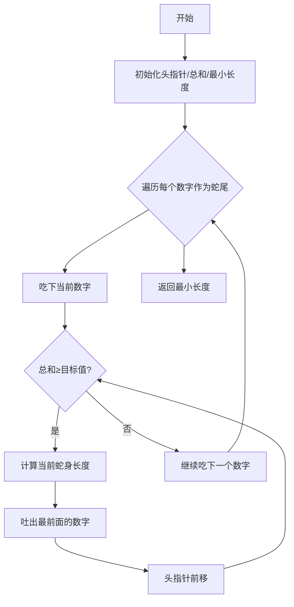

## 🎯 代码流程图（滑动窗口原理）

## 🧩 代码逐行解析
```python
class Solution:
    def minSubArrayLen(self, target: int, nums: List[int]) -> int:
        n = len(nums)                # ❶ 获取数组总长度（菜市场总摊位数量）
        head, sums, min_sub = 0, 0, float('inf') # ❷ 初始化：蛇头位置/吃进的食物量/最小记录本

        for tail in range(n):        # ❸ 蛇尾开始逐个摊位尝鲜（右指针移动）
            sums += nums[tail]       # ❹ 吞下当前摊位的食物（累加数字）
            
            while sums >= target:    # 🌟 关键点：当吃饱时开始收缩身体
                min_sub = min(min_sub, tail - head + 1) # ❺ 记录当前身体长度（尾巴-头+1）
                sums -= nums[head]   # ❻ 吐出最前面吃的那份食物（减掉头部数字）
                head += 1            # ❼ 蛇头向前缩进（左指针右移）

        return min_sub if min_sub != float('inf') else 0 # ❽ 返回记录本上的最小值
```
## ❌ 常见错误避坑
1. 初始值设置：min_sub必须设为极大值（如无穷大），否则无法正确比较最小值
2. 头指针移动条件：必须是while循环而不是if，因为可能需多次收缩才能达标 
3. 返回结果判断：若从未找到满足条件的子数组，返回0而不是无穷大 
