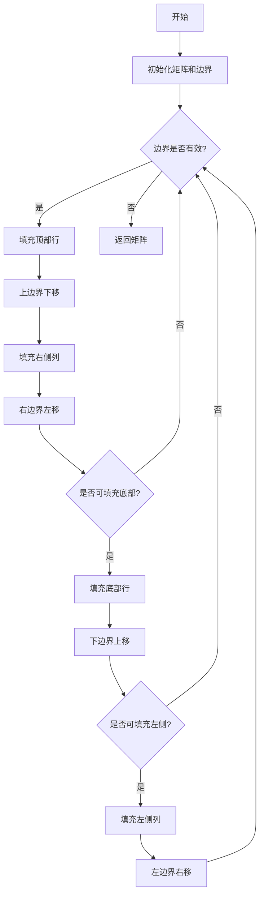

# 螺旋矩阵 II 题解

## 题目描述
生成一个包含 1 到 n² 所有元素，且按顺时针顺序螺旋排列的 n×n 矩阵。

## 算法思路
采用**边界收缩法**，通过四个指针（`left`, `right`, `top`, `bottom`）定义当前螺旋层的边界，按顺时针方向逐层填充数字。每个螺旋层包含四个填充阶段：
1. 从左到右填充顶部行
2. 从上到下填充右侧列
3. 从右到左填充底部行
4. 从下到上填充左侧列

每完成一个螺旋层后，将边界向内收缩一层。

## 代码流程图

## 代码逐行解析

```ruby
def generate_matrix(n)
  # 初始化 n×n 矩阵（每个子数组独立）
  matrix = Array.new(n) { Array.new(n, 0) }

  val = 1           # 当前填充值
  left, right = 0, n - 1  # 左右边界
  top, bottom = 0, n - 1 # 上下边界

  while left <= right && top <= bottom
    # 阶段1：填充顶部行（左→右）
    (left..right).each do |col|
      matrix[top][col] = val
      val += 1
    end
    top += 1        # 上边界下移

    # 阶段2：填充右侧列（上→下）
    (top..bottom).each do |row|
      matrix[row][right] = val
      val += 1
    end
    right -= 1      # 右边界左移

    # 阶段3：填充底部行（右→左）
    if top <= bottom  # 防止奇数n时重复填充
      right.downto(left).each do |col|
        matrix[bottom][col] = val
        val += 1
      end
      bottom -= 1    # 下边界上移
    end

    # 阶段4：填充左侧列（下→上）
    if left <= right  # 防止单列时重复填充
      bottom.downto(top).each do |row|
        matrix[row][left] = val
        val += 1
      end
      left += 1      # 左边界右移
    end
  end

  matrix
end
```